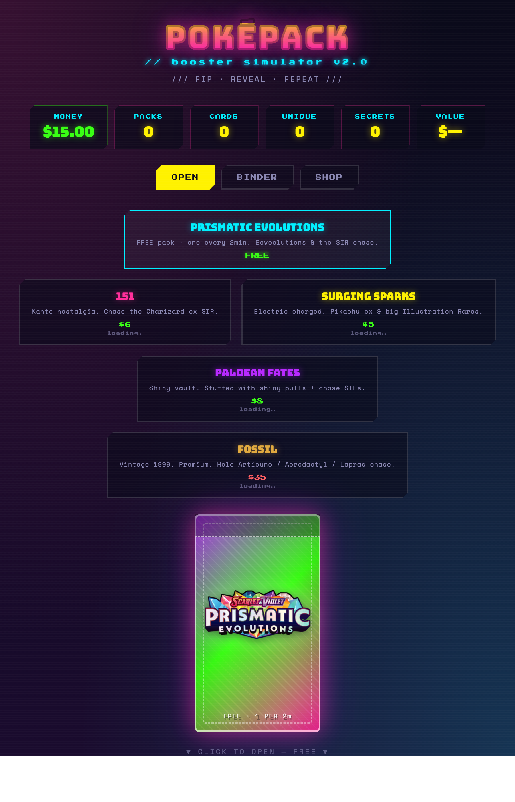

# POKÉPACK // booster simulator

A neon retro-arcade Pokémon booster-pack opening simulator built around **real
cards**. Every pull is a specific real printing from a real set — shown with its
actual card image and priced at its actual market price. Rip packs, chase the
grails, build your binder, and play the money economy — all in the browser.

### ▶ [Live demo](https://finnstevens.github.io/pokenet/)



## Stack

Deliberately minimal and **dependency-free**:

- **Vanilla JS** with native ES modules — no framework, no bundler, no transpile step.
- **Bun** only as the local dev server (`server.js`, ~30 lines, zero deps).
- **No npm packages.** Nothing in `node_modules`, nothing to audit, no supply-chain surface. External code, if ever needed, is cherry-picked and vendored in directly rather than installed.

Card data is fetched at runtime from `pokemontcg.io` (no key required): one
request loads a whole set — real card images, real rarities, and real TCGplayer
market prices per variant — cached in `localStorage` for ~24h. Prices are
indicative.

## Run it

You need [Bun](https://bun.sh). Install it (not via npm):

```sh
curl -fsSL https://bun.sh/install | bash
```

Then from the project root:

```sh
bun run dev
```

Open http://localhost:4321. Set `PORT` to use a different port.

## How it plays

- **Open** — pick a set, then click the pack to rip it. **Prismatic Evolutions is
  free** — one pack every **60 seconds** (a live countdown gates the next open).
  The other three sets — **151**, **Surging Sparks**, **Paldean Fates** — cost
  shards. Each pull is a real card; big pulls trigger a particle burst, screen
  flash, and a rarity-scaled fanfare.
- **Binder** — your collection of real cards. Filter by rarity tier or wishlist,
  search by name, sort by rarity / name / value / owned count / set & number.
  Click any card for a detail view with set, number, variant, real price, and a
  wishlist toggle.
- **Shop** — claim a daily shard reward and sell duplicate cards (at real market
  value, minus a haircut) to fund paid packs.

Everything (collection, shards, achievements, wishlist, daily + free-pack timers)
is saved to `localStorage` and restored on reload.

### Sets
Each pack costs its **real sealed single-pack market price** (set in
`src/data/sets.js`; the card API doesn't cover sealed product so these are
hand-set approximations). Card prices inside are live & exact, so vintage packs
are a high-buy-in gamble against a big chase. Approximate prices:

| Set | API id | Pack price |
|-----|--------|-----------|
| Prismatic Evolutions | `sv8pt5` | **Free** · 1 per 2 min |
| Obsidian Flames | `sv3` | ~$5 |
| Surging Sparks | `sv8` | ~$5 |
| Paldean Fates | `sv4pt5` | ~$6 |
| Crown Zenith | `swsh12pt5` | ~$10 |
| 151 | `sv3pt5` | ~$12 |
| Evolving Skies | `swsh7` | ~$15 |
| Fossil (vintage 1999) | `base3` | ~$110 |
| Base Set (vintage 1999) | `base1` | ~$350 |

Adding another set is one entry in `src/data/sets.js` (an `apiSetId`, sealed
price + pack structure) — the loader handles cards, images, and live prices.

## Project layout

```
index.html            app shell
server.js             Bun static file server (dev only)
styles/styles.css     all styling
src/
  main.js             boot + wiring
  data/sets.js        real set definitions (apiSetId, cost, pack structure)
  state/store.js      state + pub/sub + localStorage persistence (binder keyed by card uid)
  game/               pack generation, economy (incl. cooldowns), achievements
  services/           cards (real-card loader + tier mapper + cache), prices (formatter/floors), audio
  ui/                 pack / card / binder / shop / stats / modal / toast / fx
```

`docs/realism-rebuild-plan.md` records the architecture decisions. The original
prototype (`pokemon-pack-simulator-2.html`) is kept for reference.

Not affiliated with Nintendo / The Pokémon Company.
